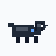
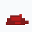

# Spaniel Smash

## Intro Story

Evil Andy has released the spaniel army to take over the ski slopes. Smash the spaniels to clear the slopes.

## Obstacle Behavior

`obstacleId` is catalog metadata only. Runtime mechanics are keyed by `entity.type` (and `behaviorState` for timed/pulsed behaviors).
`v1.2.5` restores campaign progression through level 10 (final boss clear) while keeping speed/spawn tuning capped at level 6.

| Picture | Obstacle Type | Frequency Category | Movement | Player Collision | Jump Interaction | Notes |
| --- | --- | --- | --- | --- | --- | --- |
|  | `tree` | `standard`, `rare`, `super-rare`, `mythic` | Moves vertically down slope. No lane switching. | Loses 1 life and triggers crash freeze (`650ms`) unless jump-clear applies. | Can clear only if jump is active and `jumpRule` is `low` or `high`. | Uses narrower tree collision bounds. Rendered as a pointed, layered conifer silhouette. |
|  | `rock` | `standard`, `rare`, `super-rare`, `mythic` | Moves vertically down slope. No lane switching. | Loses 1 life and triggers crash freeze unless jump-clear applies. | Can be cleared while jump is active. | Uses tighter collision bounds than its sprite extents. |
|  | `skier` | `standard` (`level 2+`), `rare` (`level 3+`), `mythic` | Moving obstacle with random lane-change attempts + cooldown. | Loses 1 life and triggers crash freeze unless jump-clear applies. | Can clear if jump is active and `jumpRule` is `low` or `high`. | Standard moving hazard behavior. |
|  | `ski-school-instructor` + `ski-school-child` | `rare` (`level 3+`) | Multi-entity moving snake formation. Instructor leads from the top/front and children trail below with phased lateral weaving. | Contact damages player (unless invulnerable) and triggers crash freeze unless jump-clear applies. | Group members use `jumpRule: low`, so active jump can clear them. | Instructor always renders in red. Children render as smaller skier sprites with varied color palettes. Child count scales with level (`level 3 => 3`, then `+2` children per level beyond 3, capped at `16`) and is clamped to a minimum of `3` children. Members of the same ski-school group do not self-collide. |
|  | `naked-skier` | `super-rare` (`level 4+`) | Moving obstacle with random lane-change attempts + cooldown. | Loses 1 life and triggers crash freeze unless jump-clear applies. | Can clear if jump is active and `jumpRule` is `low` or `high`. | Very rare variant unlocked on higher levels. |
|  | `spaniel` | `standard`, `rare`, `mythic` | Moving obstacle with random lane-change attempts + cooldown. | Gives `+100`, smash effects, and spawns `bloodstain` (no life loss). | N/A for score collision path. | Smashed count advances the current level toward the Andy boss trigger (`10-14` spaniels per level; level 1 starts at `12`). Spaniel bodies are non-lethal for obstacle-vs-obstacle mover crash checks. Tail wag is visual-only. |
|  | `black-spaniel` | `rare` (`level 2+`) | Moving obstacle with random lane-change attempts + cooldown. | Gives `+200`, smash effects, and spawns `bloodstain` (no life loss). | N/A for score collision path. | Rare double-point spaniel variant; still counts toward boss spaniel goals. |
|  | `slalom-poles` | `standard` (all levels) | Static obstacle (no lane switching). | Applies puddle-style slowdown (`900ms`) with no life loss; no crash freeze. | Jumping over poles avoids the slowdown application. | Treated as a non-lethal friction hazard (also non-lethal for mover-vs-obstacle crash transforms). |
|  | `ice-crevasse` | `rare` (`level 2+`) | Static wide hazard spanning multiple lanes. | Loses 1 life and triggers crash freeze unless jump-clear applies. | Intended jump obstacle (`jumpRule: high`) and should be jumped over. | Wider-than-lane obstacle used as a rare jump check. |
|  | `andy` | `boss encounter` | Flies in from top, hovers for ~`20s`, tracks lanes while airborne, then exits toward the bottom if not defeated. | Direct contact removes a life (unless invulnerable). Jumping into Andy defeats the boss, grants `+1800`, and awards `+2` lives. | Boss-defeat requires jump collision at overlap timing. | Rendered as a black witch on a broomstick; gameplay behavior is unchanged. Flying Andy does not convert from obstacle-vs-obstacle collisions and throws `poo-bag` projectiles during hover. Music switches to a more intense boss motif while Andy is active. |
|  | `poo-bag` | `event-driven` | Spawned by Andy and falls down the slope lane. | On hit: brown splat effect + life loss (unless invulnerable). | Not jump-clear specific. | Spawn cadence is controlled by Andy boss throw cooldown and can fan out into multi-lane throws on higher levels. |
|  | `bloodstain` | `event-driven` | Drifts vertically down slope. | No life loss; ignored by collision damage checks. | N/A | Spawned from spaniel smash/collision remains and is inert for obstacle-vs-obstacle mover crash transforms. |
|  | `puddle-patch` | `rare` (`level 2+`) | Static patch obstacle (no lane switching). | Applies slowdown effect for `900ms`; no life loss from patch contact. | No slowdown is applied while jumping over it. | Patch persists after contact; repeated grounded patch hits stack slow intensity/duration (with caps). Non-lethal for mover crash transforms. |
|  | `ice-patch` | `standard` (`level 2+`) | Static patch obstacle (no lane switching). | Applies speed-boost effect for `1400ms`; no life loss from patch contact. | No speed boost is applied while jumping over it. | Patch persists after contact; repeated grounded patch hits stack boost intensity/duration (with caps). Non-lethal for mover crash transforms. |
|  | `drone-package-drop` | `rare` (`level 3+`) | Starts in telegraph phase, then transitions to falling crate. | Telegraph phase is harmless. Falling phase behaves as damaging obstacle. | Can be jump-cleared in falling phase via low jump rule. | Telegraph duration: `650ms`. Telegraph phase is non-lethal for mover crash transforms; falling crate is lethal. |
|  | `helicopter-downdraft` | `super-rare` (`level 3+`) | Moving obstacle with random lane-change attempts + push pulses. | Wind push itself does not remove lives; direct body collision still does. | Uses `jumpRule: none` by default. | Pushes player laterally every `180ms` while overlap band is active. |

## Level & Survival Flow

- Level 1 uses a slower base spawn cadence and biases standard spawns toward `spaniel`, so non-spaniel hazards are less frequent at the start.
- Obstacle pools are staggered by level: simpler hazards dominate level 1, with `black-spaniel`/`ice-crevasse` starting at level 2 and `naked-skier` joining at level 4.
- `ski-school-snake` joins rare spawns at level 3; it starts with 3 children and adds 2 children per level after 3 (up to 16), with a hard minimum of 3 children in all spawn paths.
- Obstacle spawn cadence tightens through level 6, then stays at level-6 pacing for levels 7-10.
- Baseline downhill speed scales up through level 6, then stays at level-6 tuning for levels 7-10 before puddle/ice modifiers are applied.
- Andy boss appears once the level spaniel target is reached (`10-14` range; first level target starts at `12`).
- If Andy is defeated by jump-smash or leaves the screen, levels advance to level 10; clearing Andy on level 10 ends the run in victory.
- Lives no longer refresh at boss completion. Jump-smashing Andy adds `+2` lives, and the life total is uncapped.
- Boss exit completion is evaluated on post-move position each frame so edge-of-screen exits cannot miss level transition.
- Andy throws `poo-bag` projectiles faster through level 6 via level-scaled throw cooldowns, with slightly reduced per-level acceleration; levels 7-10 keep level-6 throw cadence while still allowing multi-lane throws.
- Level-up now includes a pulse + sparkle celebration animation behind the banner.
- After level-up (levels 1-9), spawn pacing speeds up briefly for a faster transition.
- Extra bonus obstacle spawns can trigger from level 4 onward, adding occasional pressure spikes on top of base cadence.
- Player invulnerability windows:
  - `2.6s` on level-up transitions (levels after level 1),
  - `2.2s` after each non-lethal crash respawn.
- Crash freeze now consumes none of the respawn invulnerability timer, and the force field appears once player movement resumes.
- While invulnerable, the player is surrounded by a flashing green force field.

## Controls

- Touch controls suppress long-press and gesture defaults to reduce accidental viewport zoom on mobile Safari while holding movement/jump buttons.
- Debug/testing: press `p` within the first `1s` after starting a run to force-spawn a ski-school snake with exactly 4 children.

## Web App Metadata & PWA

- `index.html` includes SEO metadata (`description`) plus Open Graph/Twitter card tags for social previews.
- Social sharing image is served from `og-image.png` (`1200x630`) and referenced by OG/Twitter metadata.
- PWA install metadata is defined in `site.webmanifest` with `standalone` display, portrait orientation, and app icons (`192`, `512`, and Apple touch icon).
- iOS home-screen support is enabled via Apple mobile web app meta tags and `apple-touch-icon.png`.
- `sw.js` caches the app shell (`index.html`, compiled scripts, manifest, icons, and splash images) to improve repeat-load and offline behavior.

Tier cadence reference: baseline spawn starts at about `540ms` on level 1, tightens by roughly `50ms` per level to about `290ms` at level 6, then holds that baseline through level 10. Post-level transition bursts start around `~230ms` and bottom out near `~150ms` on late-level transitions. `rare` remains about every `10-20s`, `super-rare` about every `60-600s`, and `mythic` about every `30-90s` after mythic unlock.
